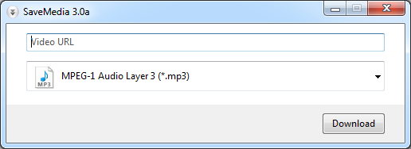

# savemedia

TL;DR - Yet another Youtube video downloader

**savemedia** provides a simple, user-friendly interface to download and convert YouTube videos.
Created for learning purposes, and FUN ;)

You can easily convert any music videos into .mp3 format.

Powered by open-source libraries: [youtube-dl](https://github.com/rg3/youtube-dl/) and [FFmpeg](http://ffmpeg.org/).

# News

[2015-05-19] released savemedia v3.0a

 * initial implementation in Python (no longer requires .NET framework)
 * moved hosting from Google Code to GitHub

# Download

It's free! [Download it here](../../releases)

# Bugs

If you run into any issue, please [let me know](../../issues)
